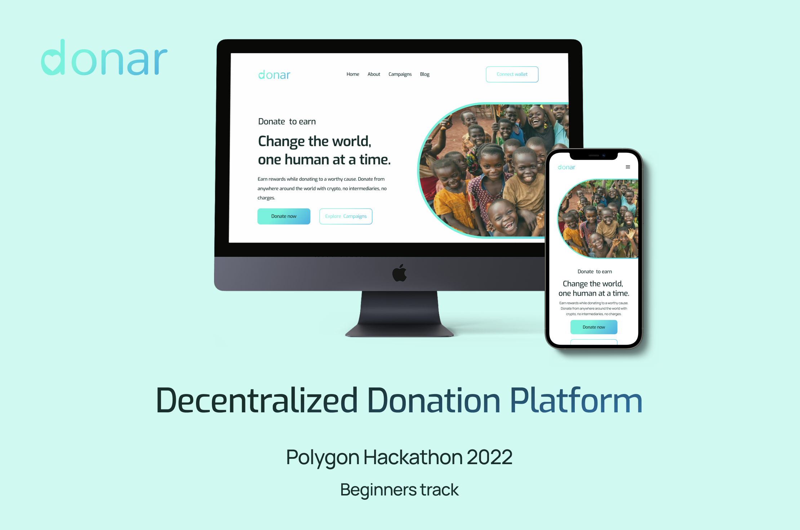

# **Donar**
### A Decentralized Donation platform

 

## **Built Using**
JavaScript (Next js), Solidity, hardhat, tailwind CSS, Openzeppelin, Figma.

 

## **About Donar**

Donar is a Decentralized application that allows people to donate in cryptocurrencies to support NGO's anywhere in Africa. The goal of Donar is to: 
- Bridge the gap between people seeking to donate, and Organization/communities in need of support 
- Make donating decentralized and trustless
- Incentivize Donors

 

## **Features**
**implemented**
- Connect wallet (Donors)
- Register (NGO)
- Explore campaigns
- Campaign details
- Donate to campaign (in METIC)
- Earn Rewards
- Donation history

**Nice to have**
- Blog
- NGOs
- Top Donors

 

## **Platform**
Web

 

## **Deliverables**
- Userflow
- [Design](https://www.figma.com/file/0Jg0Sh78iM3Egn4BQerFMA/Donar-app-design?node-id=0%3A1&t=ql5XS8FvtopEdvBP-0)
- [Live Product](https://donar12.vercel.app/)

 

## **Project Duration**
2weeks

 

## **Contributors**

- Elizabeth Bassey (Designer) - Project Lead
- Adejori Eniola Emmanuel - Frontend Developer
- Okhamena Azeez - Backend/Solidity Developer

 

_Donar is a team project in the polygon's 2022 hackaton, built in within a short period of time. We hope that we are given the oppotunity and support to futher this project to a full scale enterprize level DApp._
